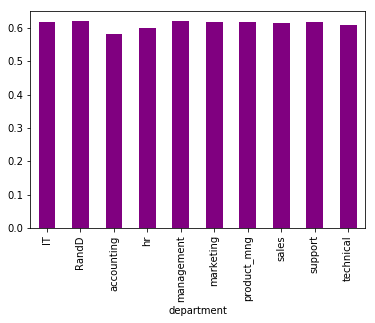

The first order of business when it comes to data science in python is to import all the necessary packages


```python
import numpy as np
import pandas as pd
import matplotlib.pyplot as plt
import seaborn as sns
import warnings
warnings.filterwarnings("ignore")

from sklearn.linear_model import SGDClassifier
from sklearn.preprocessing import LabelEncoder
from sklearn.model_selection import train_test_split
from sklearn.ensemble import RandomForestClassifier
from sklearn.calibration import CalibratedClassifierCV
from sklearn.model_selection import GridSearchCV
from sklearn.model_selection import StratifiedKFold
from sklearn.feature_selection import SelectFromModel
from sklearn.linear_model import LogisticRegression
from sklearn import svm
from matplotlib.pyplot import pie, axis, show
```

The data we would be using here is HR obtained from Kaggle and is available in this repository inside the "Datasets" folder.
Using this data I would attempt to answer the following questions:
    1. "What are the primary reasons that motivate people to leave this company"
    2. "Who among all of the current employees that are likely to leave this company"
Answering those two questions will prove to be beneficial for the HR department's attempt to formulate a strategy to prevent
employees from leaving.

As you can see below, I have read the dataset and call a describe() function to provide a succinct description of the dataset.


```python
df = pd.read_csv('Datasets/HR_comma_sep.csv')
df.describe()
```


<div>
<table border="1" class="dataframe">
  <thead>
    <tr style="text-align: right;">
      <th></th>
      <th>satisfaction_level</th>
      <th>last_evaluation</th>
      <th>number_project</th>
      <th>average_montly_hours</th>
      <th>time_spend_company</th>
      <th>Work_accident</th>
      <th>left</th>
      <th>promotion_last_5years</th>
    </tr>
  </thead>
  <tbody>
    <tr>
      <th>count</th>
      <td>14999.000000</td>
      <td>14999.000000</td>
      <td>14999.000000</td>
      <td>14999.000000</td>
      <td>14999.000000</td>
      <td>14999.000000</td>
      <td>14999.000000</td>
      <td>14999.000000</td>
    </tr>
    <tr>
      <th>mean</th>
      <td>0.612834</td>
      <td>0.716102</td>
      <td>3.803054</td>
      <td>201.050337</td>
      <td>3.498233</td>
      <td>0.144610</td>
      <td>0.238083</td>
      <td>0.021268</td>
    </tr>
    <tr>
      <th>std</th>
      <td>0.248631</td>
      <td>0.171169</td>
      <td>1.232592</td>
      <td>49.943099</td>
      <td>1.460136</td>
      <td>0.351719</td>
      <td>0.425924</td>
      <td>0.144281</td>
    </tr>
    <tr>
      <th>min</th>
      <td>0.090000</td>
      <td>0.360000</td>
      <td>2.000000</td>
      <td>96.000000</td>
      <td>2.000000</td>
      <td>0.000000</td>
      <td>0.000000</td>
      <td>0.000000</td>
    </tr>
    <tr>
      <th>25%</th>
      <td>0.440000</td>
      <td>0.560000</td>
      <td>3.000000</td>
      <td>156.000000</td>
      <td>3.000000</td>
      <td>0.000000</td>
      <td>0.000000</td>
      <td>0.000000</td>
    </tr>
    <tr>
      <th>50%</th>
      <td>0.640000</td>
      <td>0.720000</td>
      <td>4.000000</td>
      <td>200.000000</td>
      <td>3.000000</td>
      <td>0.000000</td>
      <td>0.000000</td>
      <td>0.000000</td>
    </tr>
    <tr>
      <th>75%</th>
      <td>0.820000</td>
      <td>0.870000</td>
      <td>5.000000</td>
      <td>245.000000</td>
      <td>4.000000</td>
      <td>0.000000</td>
      <td>0.000000</td>
      <td>0.000000</td>
    </tr>
    <tr>
      <th>max</th>
      <td>1.000000</td>
      <td>1.000000</td>
      <td>7.000000</td>
      <td>310.000000</td>
      <td>10.000000</td>
      <td>1.000000</td>
      <td>1.000000</td>
      <td>1.000000</td>
    </tr>
  </tbody>
</table>
</div>


And below I am going to list the first five records/row of the dataset


```python
df.head()
```


<div>
<table border="1" class="dataframe">
  <thead>
    <tr style="text-align: right;">
      <th></th>
      <th>satisfaction_level</th>
      <th>last_evaluation</th>
      <th>number_project</th>
      <th>average_montly_hours</th>
      <th>time_spend_company</th>
      <th>Work_accident</th>
      <th>left</th>
      <th>promotion_last_5years</th>
      <th>sales</th>
      <th>salary</th>
    </tr>
  </thead>
  <tbody>
    <tr>
      <th>0</th>
      <td>0.38</td>
      <td>0.53</td>
      <td>2</td>
      <td>157</td>
      <td>3</td>
      <td>0</td>
      <td>1</td>
      <td>0</td>
      <td>sales</td>
      <td>low</td>
    </tr>
    <tr>
      <th>1</th>
      <td>0.80</td>
      <td>0.86</td>
      <td>5</td>
      <td>262</td>
      <td>6</td>
      <td>0</td>
      <td>1</td>
      <td>0</td>
      <td>sales</td>
      <td>medium</td>
    </tr>
    <tr>
      <th>2</th>
      <td>0.11</td>
      <td>0.88</td>
      <td>7</td>
      <td>272</td>
      <td>4</td>
      <td>0</td>
      <td>1</td>
      <td>0</td>
      <td>sales</td>
      <td>medium</td>
    </tr>
    <tr>
      <th>3</th>
      <td>0.72</td>
      <td>0.87</td>
      <td>5</td>
      <td>223</td>
      <td>5</td>
      <td>0</td>
      <td>1</td>
      <td>0</td>
      <td>sales</td>
      <td>low</td>
    </tr>
    <tr>
      <th>4</th>
      <td>0.37</td>
      <td>0.52</td>
      <td>2</td>
      <td>159</td>
      <td>3</td>
      <td>0</td>
      <td>1</td>
      <td>0</td>
      <td>sales</td>
      <td>low</td>
    </tr>
  </tbody>
</table>
</div>


On the generated table above we can see there is a bit of a misnomer, the column "sales" should really be named "department" as it contains the department in which the employee is currently working. So I shall rename the column "sales" to "department"


```python
df.rename(columns={'sales': 'department'}, inplace=True)
df.head()
```


<div>
<table border="1" class="dataframe">
  <thead>
    <tr style="text-align: right;">
      <th></th>
      <th>satisfaction_level</th>
      <th>last_evaluation</th>
      <th>number_project</th>
      <th>average_montly_hours</th>
      <th>time_spend_company</th>
      <th>Work_accident</th>
      <th>left</th>
      <th>promotion_last_5years</th>
      <th>department</th>
      <th>salary</th>
    </tr>
  </thead>
  <tbody>
    <tr>
      <th>0</th>
      <td>0.38</td>
      <td>0.53</td>
      <td>2</td>
      <td>157</td>
      <td>3</td>
      <td>0</td>
      <td>1</td>
      <td>0</td>
      <td>sales</td>
      <td>low</td>
    </tr>
    <tr>
      <th>1</th>
      <td>0.80</td>
      <td>0.86</td>
      <td>5</td>
      <td>262</td>
      <td>6</td>
      <td>0</td>
      <td>1</td>
      <td>0</td>
      <td>sales</td>
      <td>medium</td>
    </tr>
    <tr>
      <th>2</th>
      <td>0.11</td>
      <td>0.88</td>
      <td>7</td>
      <td>272</td>
      <td>4</td>
      <td>0</td>
      <td>1</td>
      <td>0</td>
      <td>sales</td>
      <td>medium</td>
    </tr>
    <tr>
      <th>3</th>
      <td>0.72</td>
      <td>0.87</td>
      <td>5</td>
      <td>223</td>
      <td>5</td>
      <td>0</td>
      <td>1</td>
      <td>0</td>
      <td>sales</td>
      <td>low</td>
    </tr>
    <tr>
      <th>4</th>
      <td>0.37</td>
      <td>0.52</td>
      <td>2</td>
      <td>159</td>
      <td>3</td>
      <td>0</td>
      <td>1</td>
      <td>0</td>
      <td>sales</td>
      <td>low</td>
    </tr>
  </tbody>
</table>
</div>


There, much better :)

Having done that, I will next list all the departments available in this company by looking at the unique values of the "department" column


```python
df['department'].unique()
```


    array(['sales', 'accounting', 'hr', 'technical', 'support', 'management',
           'IT', 'product_mng', 'marketing', 'RandD'], dtype=object)


So there appears to be 10 departments in this company: Sales, Accounting, Human Resources, Technical, Support, Management, IT, Product Manager, Marketing, and Research and Department.

Moving on, I am going to list the number of those who had already left the company, those who are still working, and the percentage of people who had left in the whole dataset.


```python
print('Number of individuals who had left : ', format(df[df['left']==1].size))
print('Number of individuals who stayed : ', format(df[df['left']==0].size))
print('Percentage of people who had left :', format(int(df[df['left']==1].size/df.size*100)), '%')
```

    Number of individuals who had left :  35710
    Number of individuals who stayed :  114280
    Percentage of people who had left : 23 %


A major factor in the employee's decision to leave their current job is the amount of work they do everyday, so in the code below I shall take a look at the average amount of time all the employees of this company spend working each day.


```python
df.mean()['average_montly_hours']/30
```


    6.7016778896370868


It appears that the employees on average spend 6.7 hours per day working, we should compare the amount of time all the employees that has already left the company spend each day with the average to see whether this is a contributing factor in their decision to leave.


```python
ex_employee_work_time = df[df['left'] == 1]['average_montly_hours']
ex_employee_work_time.mean()/30
```


    6.9139736768412208


So it seems that ex-employees are on average working a bit more than the overall average, this is interesting but we should dig deeper to find an exact answer.

Next I am going to generate a correlation matrix that can provide us with information on how different features of the dataset correlate to each other.


```python
correlation_matrix = df.corr()
correlation_matrix
```


<div>
<table border="1" class="dataframe">
  <thead>
    <tr style="text-align: right;">
      <th></th>
      <th>satisfaction_level</th>
      <th>last_evaluation</th>
      <th>number_project</th>
      <th>average_montly_hours</th>
      <th>time_spend_company</th>
      <th>Work_accident</th>
      <th>left</th>
      <th>promotion_last_5years</th>
    </tr>
  </thead>
  <tbody>
    <tr>
      <th>satisfaction_level</th>
      <td>1.000000</td>
      <td>0.105021</td>
      <td>-0.142970</td>
      <td>-0.020048</td>
      <td>-0.100866</td>
      <td>0.058697</td>
      <td>-0.388375</td>
      <td>0.025605</td>
    </tr>
    <tr>
      <th>last_evaluation</th>
      <td>0.105021</td>
      <td>1.000000</td>
      <td>0.349333</td>
      <td>0.339742</td>
      <td>0.131591</td>
      <td>-0.007104</td>
      <td>0.006567</td>
      <td>-0.008684</td>
    </tr>
    <tr>
      <th>number_project</th>
      <td>-0.142970</td>
      <td>0.349333</td>
      <td>1.000000</td>
      <td>0.417211</td>
      <td>0.196786</td>
      <td>-0.004741</td>
      <td>0.023787</td>
      <td>-0.006064</td>
    </tr>
    <tr>
      <th>average_montly_hours</th>
      <td>-0.020048</td>
      <td>0.339742</td>
      <td>0.417211</td>
      <td>1.000000</td>
      <td>0.127755</td>
      <td>-0.010143</td>
      <td>0.071287</td>
      <td>-0.003544</td>
    </tr>
    <tr>
      <th>time_spend_company</th>
      <td>-0.100866</td>
      <td>0.131591</td>
      <td>0.196786</td>
      <td>0.127755</td>
      <td>1.000000</td>
      <td>0.002120</td>
      <td>0.144822</td>
      <td>0.067433</td>
    </tr>
    <tr>
      <th>Work_accident</th>
      <td>0.058697</td>
      <td>-0.007104</td>
      <td>-0.004741</td>
      <td>-0.010143</td>
      <td>0.002120</td>
      <td>1.000000</td>
      <td>-0.154622</td>
      <td>0.039245</td>
    </tr>
    <tr>
      <th>left</th>
      <td>-0.388375</td>
      <td>0.006567</td>
      <td>0.023787</td>
      <td>0.071287</td>
      <td>0.144822</td>
      <td>-0.154622</td>
      <td>1.000000</td>
      <td>-0.061788</td>
    </tr>
    <tr>
      <th>promotion_last_5years</th>
      <td>0.025605</td>
      <td>-0.008684</td>
      <td>-0.006064</td>
      <td>-0.003544</td>
      <td>0.067433</td>
      <td>0.039245</td>
      <td>-0.061788</td>
      <td>1.000000</td>
    </tr>
  </tbody>
</table>
</div>


I am going to make a heatmap of the above correlation matrix so we can easily analyze them.


```python
sns.heatmap(correlation_matrix, annot=True, vmax = .8, cmap="YlGnBu")
plt.show()
```


From the above heatmap we can understand a lot about how one feature of the data effects another, for instance:
    1. The number of project an employee has done correlates negatively with the satisfaction level
    2. The time spent at the company correlates negatively with the satisfaction level
    3. The last evaluation of an employee correlates positively with the number of project an employee has done

Next, I will divide the employee based on their salary level(high, medium, low)


```python
sal_l = df[df['salary'] == 'low']
sal_m = df[df['salary'] == 'medium']
sal_h = df[df['salary'] == 'high']

print('Low salary employees total : ', len(sal_l))
print('Medium salary employees total : ', len(sal_m))
print('High salary employees : ', len(sal_h))
```

    Low salary employees total :  7316
    Medium salary employees total :  6446
    High salary employees :  1237


I will analyze further the employees belonging to each salary level


```python
desc_l = sal_l.describe()
print("Low Salary Employee :")
desc_l.iloc[1:2, :]
```

    Low Salary Employee :


<div>
<table border="1" class="dataframe">
  <thead>
    <tr style="text-align: right;">
      <th></th>
      <th>satisfaction_level</th>
      <th>last_evaluation</th>
      <th>number_project</th>
      <th>average_montly_hours</th>
      <th>time_spend_company</th>
      <th>Work_accident</th>
      <th>left</th>
      <th>promotion_last_5years</th>
    </tr>
  </thead>
  <tbody>
    <tr>
      <th>mean</th>
      <td>0.600753</td>
      <td>0.717017</td>
      <td>3.799891</td>
      <td>200.996583</td>
      <td>3.438218</td>
      <td>0.142154</td>
      <td>0.296884</td>
      <td>0.009021</td>
    </tr>
  </tbody>
</table>
</div>


```python
desc_m = sal_m.describe()
print("Medium Salary Employee :")
desc_m.iloc[1:2, :]
```

    Medium Salary Employee :


<div>
<table border="1" class="dataframe">
  <thead>
    <tr style="text-align: right;">
      <th></th>
      <th>satisfaction_level</th>
      <th>last_evaluation</th>
      <th>number_project</th>
      <th>average_montly_hours</th>
      <th>time_spend_company</th>
      <th>Work_accident</th>
      <th>left</th>
      <th>promotion_last_5years</th>
    </tr>
  </thead>
  <tbody>
    <tr>
      <th>mean</th>
      <td>0.621817</td>
      <td>0.717322</td>
      <td>3.813528</td>
      <td>201.338349</td>
      <td>3.52901</td>
      <td>0.145361</td>
      <td>0.204313</td>
      <td>0.028079</td>
    </tr>
  </tbody>
</table>
</div>


```python
desc_h = sal_h.describe()
print("High Salary Employee :")
desc_h.iloc[1:2, :]
```

    High Salary Employee :


<div>
<table border="1" class="dataframe">
  <thead>
    <tr style="text-align: right;">
      <th></th>
      <th>satisfaction_level</th>
      <th>last_evaluation</th>
      <th>number_project</th>
      <th>average_montly_hours</th>
      <th>time_spend_company</th>
      <th>Work_accident</th>
      <th>left</th>
      <th>promotion_last_5years</th>
    </tr>
  </thead>
  <tbody>
    <tr>
      <th>mean</th>
      <td>0.63747</td>
      <td>0.704325</td>
      <td>3.767179</td>
      <td>199.867421</td>
      <td>3.692805</td>
      <td>0.155214</td>
      <td>0.066289</td>
      <td>0.058205</td>
    </tr>
  </tbody>
</table>
</div>


Looking at the three tables above, we can see that as the salary level increases, the number of ex-employee decreases. This is rather obvious seeing that employees would normaly stay in a company that pays them highly. We can also see from the tables that the satisfaction level seems to increase slightly as the salary level increases.

In the chart above we can see the distribution of employees in different departments according their salary level, and below I will chart the average satisfaction level of each department employees


```python
df.groupby('department').mean()['satisfaction_level'].plot(kind='bar',color='purple')
plt.show()
```





Apparently the employees in the accounting department has the least average satisfaction level, although I'm sure this won't be the case at Deloitte's ;)

After looking around the dataset, I will now attempt to train a machine learning algorithm to predict which employee is going to quit. We will start that by first converting all the string categorical variables to simple integer dummy variables


```python
df_copy = pd.get_dummies(df)
df_copy.head()
```


<div>
<table border="1" class="dataframe">
  <thead>
    <tr style="text-align: right;">
      <th></th>
      <th>satisfaction_level</th>
      <th>last_evaluation</th>
      <th>number_project</th>
      <th>average_montly_hours</th>
      <th>time_spend_company</th>
      <th>Work_accident</th>
      <th>left</th>
      <th>promotion_last_5years</th>
      <th>department_IT</th>
      <th>department_RandD</th>
      <th>...</th>
      <th>department_hr</th>
      <th>department_management</th>
      <th>department_marketing</th>
      <th>department_product_mng</th>
      <th>department_sales</th>
      <th>department_support</th>
      <th>department_technical</th>
      <th>salary_high</th>
      <th>salary_low</th>
      <th>salary_medium</th>
    </tr>
  </thead>
  <tbody>
    <tr>
      <th>0</th>
      <td>0.38</td>
      <td>0.53</td>
      <td>2</td>
      <td>157</td>
      <td>3</td>
      <td>0</td>
      <td>1</td>
      <td>0</td>
      <td>0</td>
      <td>0</td>
      <td>...</td>
      <td>0</td>
      <td>0</td>
      <td>0</td>
      <td>0</td>
      <td>1</td>
      <td>0</td>
      <td>0</td>
      <td>0</td>
      <td>1</td>
      <td>0</td>
    </tr>
    <tr>
      <th>1</th>
      <td>0.80</td>
      <td>0.86</td>
      <td>5</td>
      <td>262</td>
      <td>6</td>
      <td>0</td>
      <td>1</td>
      <td>0</td>
      <td>0</td>
      <td>0</td>
      <td>...</td>
      <td>0</td>
      <td>0</td>
      <td>0</td>
      <td>0</td>
      <td>1</td>
      <td>0</td>
      <td>0</td>
      <td>0</td>
      <td>0</td>
      <td>1</td>
    </tr>
    <tr>
      <th>2</th>
      <td>0.11</td>
      <td>0.88</td>
      <td>7</td>
      <td>272</td>
      <td>4</td>
      <td>0</td>
      <td>1</td>
      <td>0</td>
      <td>0</td>
      <td>0</td>
      <td>...</td>
      <td>0</td>
      <td>0</td>
      <td>0</td>
      <td>0</td>
      <td>1</td>
      <td>0</td>
      <td>0</td>
      <td>0</td>
      <td>0</td>
      <td>1</td>
    </tr>
    <tr>
      <th>3</th>
      <td>0.72</td>
      <td>0.87</td>
      <td>5</td>
      <td>223</td>
      <td>5</td>
      <td>0</td>
      <td>1</td>
      <td>0</td>
      <td>0</td>
      <td>0</td>
      <td>...</td>
      <td>0</td>
      <td>0</td>
      <td>0</td>
      <td>0</td>
      <td>1</td>
      <td>0</td>
      <td>0</td>
      <td>0</td>
      <td>1</td>
      <td>0</td>
    </tr>
    <tr>
      <th>4</th>
      <td>0.37</td>
      <td>0.52</td>
      <td>2</td>
      <td>159</td>
      <td>3</td>
      <td>0</td>
      <td>1</td>
      <td>0</td>
      <td>0</td>
      <td>0</td>
      <td>...</td>
      <td>0</td>
      <td>0</td>
      <td>0</td>
      <td>0</td>
      <td>1</td>
      <td>0</td>
      <td>0</td>
      <td>0</td>
      <td>1</td>
      <td>0</td>
    </tr>
  </tbody>
</table>
<p>5 rows × 21 columns</p>
</div>


Now we will separate the ex-employees and make it into a target variable


```python
df1 = df_copy
y = df1['left'].values
df1 = df1.drop(['left'],axis=1)
X = df1.values
```

I will now split both the dataset and the target variable into 2 subsets of training data and test data, this is done to allow us to cross-validate the machine learning model and prevent underfitting or overfitting


```python
X_train, X_test, y_train, y_test = train_test_split(X, y, test_size=0.7)
```

I will now create three different machine learning model consisting of: logistic regression, stochastic gradient descent classifier, and a random forest classifier. We will cross-validate each of these machine learning model and see which one has the highest accuracy score.


```python
reg = LogisticRegression()
reg.fit(X_train, y_train)
print("Accuracy score : ", reg.score(X_test, y_test))
```

    Accuracy score :  0.78580952381


```python
sgd = SGDClassifier()
sgd.fit(X_train, y_train)
print("Accuracy score : ", sgd.score(X_test, y_test))
```

    Accuracy score :  0.759619047619


```python
rfc = RandomForestClassifier()
rfc.fit(X_train, y_train)
print("Accuracy score : ", rfc.score(X_test, y_test))
```

    Accuracy score :  0.979142857143


Looking at each of the machine learning model accuracy scores, it is obvious that the random forest classifier is the best. I am very pleased to find this, as using random forest classifier allows us to rank the feature of our dataset according to their importance, which I will do below


```python
indices = np.argsort(rfc.feature_importances_)[::-1]

for f in range(df1.shape[1]):
    print('%s (%f)' % (df1.columns[indices[f]], rfc.feature_importances_[indices[f]]))
```

    satisfaction_level (0.273716)
    number_project (0.219028)
    average_montly_hours (0.184047)
    time_spend_company (0.170171)
    last_evaluation (0.099152)
    Work_accident (0.010931)
    salary_low (0.006543)
    department_technical (0.004948)
    salary_medium (0.004852)
    department_sales (0.003809)
    salary_high (0.003633)
    department_hr (0.002954)
    department_IT (0.002733)
    department_support (0.002559)
    department_accounting (0.002268)
    department_RandD (0.002193)
    department_marketing (0.002083)
    promotion_last_5years (0.001829)
    department_product_mng (0.001305)
    department_management (0.001246)


Above we can see the list of features ranked based on their importance to the employee's decision to leave the company. The top 5 reasons are: satisfaction level, number of projects, average monthly working hours, time spent at the company, and last evaluation. This should sufficiently answer our first question.

It is now time to answer the second question of "Who among all of the current employees that are likely to leave this company". I will attempt to do this by using the random forest classifier model that we have trained previously


```python
stay = df[df['left'] == 0]
stay_copy = pd.get_dummies(stay)
```


```python
df1 = stay_copy
y = df1['left'].values
df1 = df1.drop(['left'],axis=1)
X = df1.values
```


```python
pred = rfc.predict(X)
```


```python
stay['may_leave'] = pred
stay.head()
```


<div>
<table border="1" class="dataframe">
  <thead>
    <tr style="text-align: right;">
      <th></th>
      <th>satisfaction_level</th>
      <th>last_evaluation</th>
      <th>number_project</th>
      <th>average_montly_hours</th>
      <th>time_spend_company</th>
      <th>Work_accident</th>
      <th>left</th>
      <th>promotion_last_5years</th>
      <th>department</th>
      <th>salary</th>
      <th>may_leave</th>
    </tr>
  </thead>
  <tbody>
    <tr>
      <th>2000</th>
      <td>0.58</td>
      <td>0.74</td>
      <td>4</td>
      <td>215</td>
      <td>3</td>
      <td>0</td>
      <td>0</td>
      <td>0</td>
      <td>sales</td>
      <td>low</td>
      <td>0</td>
    </tr>
    <tr>
      <th>2001</th>
      <td>0.82</td>
      <td>0.67</td>
      <td>2</td>
      <td>202</td>
      <td>3</td>
      <td>0</td>
      <td>0</td>
      <td>0</td>
      <td>sales</td>
      <td>low</td>
      <td>0</td>
    </tr>
    <tr>
      <th>2002</th>
      <td>0.45</td>
      <td>0.69</td>
      <td>5</td>
      <td>193</td>
      <td>3</td>
      <td>0</td>
      <td>0</td>
      <td>0</td>
      <td>sales</td>
      <td>low</td>
      <td>0</td>
    </tr>
    <tr>
      <th>2003</th>
      <td>0.78</td>
      <td>0.82</td>
      <td>5</td>
      <td>247</td>
      <td>3</td>
      <td>0</td>
      <td>0</td>
      <td>0</td>
      <td>sales</td>
      <td>low</td>
      <td>0</td>
    </tr>
    <tr>
      <th>2004</th>
      <td>0.49</td>
      <td>0.60</td>
      <td>3</td>
      <td>214</td>
      <td>2</td>
      <td>0</td>
      <td>0</td>
      <td>0</td>
      <td>sales</td>
      <td>low</td>
      <td>0</td>
    </tr>
  </tbody>
</table>
</div>


After using the random forest classifier to calculate the probability of leaving for each employee, I will filter out those who are predicted to leave the company


```python
leaving_ind = stay[stay['may_leave'] == 1]
leaving_ind
```


<div>
<table border="1" class="dataframe">
  <thead>
    <tr style="text-align: right;">
      <th></th>
      <th>satisfaction_level</th>
      <th>last_evaluation</th>
      <th>number_project</th>
      <th>average_montly_hours</th>
      <th>time_spend_company</th>
      <th>Work_accident</th>
      <th>left</th>
      <th>promotion_last_5years</th>
      <th>department</th>
      <th>salary</th>
      <th>may_leave</th>
    </tr>
  </thead>
  <tbody>
    <tr>
      <th>2703</th>
      <td>0.76</td>
      <td>0.93</td>
      <td>3</td>
      <td>271</td>
      <td>5</td>
      <td>0</td>
      <td>0</td>
      <td>0</td>
      <td>hr</td>
      <td>low</td>
      <td>1</td>
    </tr>
    <tr>
      <th>3079</th>
      <td>0.82</td>
      <td>0.97</td>
      <td>3</td>
      <td>244</td>
      <td>5</td>
      <td>0</td>
      <td>0</td>
      <td>0</td>
      <td>sales</td>
      <td>medium</td>
      <td>1</td>
    </tr>
    <tr>
      <th>3780</th>
      <td>0.86</td>
      <td>0.96</td>
      <td>5</td>
      <td>238</td>
      <td>5</td>
      <td>0</td>
      <td>0</td>
      <td>0</td>
      <td>technical</td>
      <td>low</td>
      <td>1</td>
    </tr>
    <tr>
      <th>5565</th>
      <td>0.84</td>
      <td>0.84</td>
      <td>6</td>
      <td>261</td>
      <td>5</td>
      <td>0</td>
      <td>0</td>
      <td>0</td>
      <td>product_mng</td>
      <td>low</td>
      <td>1</td>
    </tr>
    <tr>
      <th>5586</th>
      <td>0.81</td>
      <td>0.99</td>
      <td>2</td>
      <td>156</td>
      <td>5</td>
      <td>0</td>
      <td>0</td>
      <td>0</td>
      <td>sales</td>
      <td>medium</td>
      <td>1</td>
    </tr>
    <tr>
      <th>5662</th>
      <td>0.44</td>
      <td>0.87</td>
      <td>2</td>
      <td>140</td>
      <td>4</td>
      <td>0</td>
      <td>0</td>
      <td>0</td>
      <td>sales</td>
      <td>high</td>
      <td>1</td>
    </tr>
    <tr>
      <th>5762</th>
      <td>0.79</td>
      <td>0.90</td>
      <td>5</td>
      <td>212</td>
      <td>5</td>
      <td>0</td>
      <td>0</td>
      <td>0</td>
      <td>technical</td>
      <td>low</td>
      <td>1</td>
    </tr>
    <tr>
      <th>5847</th>
      <td>0.77</td>
      <td>0.85</td>
      <td>5</td>
      <td>221</td>
      <td>5</td>
      <td>0</td>
      <td>0</td>
      <td>0</td>
      <td>technical</td>
      <td>low</td>
      <td>1</td>
    </tr>
    <tr>
      <th>6358</th>
      <td>0.81</td>
      <td>0.98</td>
      <td>5</td>
      <td>243</td>
      <td>6</td>
      <td>0</td>
      <td>0</td>
      <td>0</td>
      <td>sales</td>
      <td>medium</td>
      <td>1</td>
    </tr>
    <tr>
      <th>7004</th>
      <td>0.85</td>
      <td>0.87</td>
      <td>6</td>
      <td>232</td>
      <td>6</td>
      <td>0</td>
      <td>0</td>
      <td>0</td>
      <td>technical</td>
      <td>low</td>
      <td>1</td>
    </tr>
    <tr>
      <th>7443</th>
      <td>0.85</td>
      <td>0.96</td>
      <td>4</td>
      <td>240</td>
      <td>6</td>
      <td>0</td>
      <td>0</td>
      <td>0</td>
      <td>technical</td>
      <td>medium</td>
      <td>1</td>
    </tr>
    <tr>
      <th>7732</th>
      <td>0.39</td>
      <td>0.68</td>
      <td>2</td>
      <td>137</td>
      <td>3</td>
      <td>1</td>
      <td>0</td>
      <td>0</td>
      <td>sales</td>
      <td>low</td>
      <td>1</td>
    </tr>
    <tr>
      <th>7762</th>
      <td>0.82</td>
      <td>0.87</td>
      <td>5</td>
      <td>273</td>
      <td>6</td>
      <td>0</td>
      <td>0</td>
      <td>0</td>
      <td>support</td>
      <td>medium</td>
      <td>1</td>
    </tr>
    <tr>
      <th>7918</th>
      <td>0.90</td>
      <td>0.81</td>
      <td>6</td>
      <td>273</td>
      <td>5</td>
      <td>0</td>
      <td>0</td>
      <td>0</td>
      <td>technical</td>
      <td>medium</td>
      <td>1</td>
    </tr>
    <tr>
      <th>7989</th>
      <td>0.36</td>
      <td>0.45</td>
      <td>2</td>
      <td>135</td>
      <td>3</td>
      <td>1</td>
      <td>0</td>
      <td>0</td>
      <td>support</td>
      <td>high</td>
      <td>1</td>
    </tr>
    <tr>
      <th>8522</th>
      <td>0.31</td>
      <td>0.53</td>
      <td>2</td>
      <td>146</td>
      <td>3</td>
      <td>1</td>
      <td>0</td>
      <td>0</td>
      <td>support</td>
      <td>low</td>
      <td>1</td>
    </tr>
    <tr>
      <th>8992</th>
      <td>0.41</td>
      <td>0.69</td>
      <td>2</td>
      <td>152</td>
      <td>4</td>
      <td>1</td>
      <td>0</td>
      <td>0</td>
      <td>IT</td>
      <td>low</td>
      <td>1</td>
    </tr>
    <tr>
      <th>9263</th>
      <td>0.41</td>
      <td>0.70</td>
      <td>2</td>
      <td>151</td>
      <td>3</td>
      <td>1</td>
      <td>0</td>
      <td>0</td>
      <td>accounting</td>
      <td>low</td>
      <td>1</td>
    </tr>
    <tr>
      <th>9913</th>
      <td>0.42</td>
      <td>0.58</td>
      <td>2</td>
      <td>140</td>
      <td>3</td>
      <td>0</td>
      <td>0</td>
      <td>0</td>
      <td>IT</td>
      <td>low</td>
      <td>1</td>
    </tr>
    <tr>
      <th>10098</th>
      <td>0.73</td>
      <td>0.83</td>
      <td>5</td>
      <td>266</td>
      <td>5</td>
      <td>0</td>
      <td>0</td>
      <td>0</td>
      <td>sales</td>
      <td>low</td>
      <td>1</td>
    </tr>
    <tr>
      <th>11743</th>
      <td>0.79</td>
      <td>0.86</td>
      <td>5</td>
      <td>238</td>
      <td>8</td>
      <td>0</td>
      <td>0</td>
      <td>0</td>
      <td>sales</td>
      <td>low</td>
      <td>1</td>
    </tr>
    <tr>
      <th>11980</th>
      <td>0.79</td>
      <td>0.87</td>
      <td>4</td>
      <td>223</td>
      <td>5</td>
      <td>0</td>
      <td>0</td>
      <td>0</td>
      <td>sales</td>
      <td>medium</td>
      <td>1</td>
    </tr>
    <tr>
      <th>13954</th>
      <td>0.79</td>
      <td>0.86</td>
      <td>5</td>
      <td>238</td>
      <td>8</td>
      <td>0</td>
      <td>0</td>
      <td>0</td>
      <td>sales</td>
      <td>low</td>
      <td>1</td>
    </tr>
    <tr>
      <th>14191</th>
      <td>0.79</td>
      <td>0.87</td>
      <td>4</td>
      <td>223</td>
      <td>5</td>
      <td>0</td>
      <td>0</td>
      <td>0</td>
      <td>sales</td>
      <td>medium</td>
      <td>1</td>
    </tr>
  </tbody>
</table>
</div>


And there we have it! A list of employees that are likely to leave the company, thus answering our second question of "Who among all of the current employees that are likely to leave this company". And one last thing, below I have created a pie chart of that can provide us with information regarding which department has the highest number of people leaving.


```python
sums = leaving_ind.may_leave.groupby(leaving_ind.department).sum()
axis('equal');
pie(sums, labels=sums.index);
show()
```


```python

```
